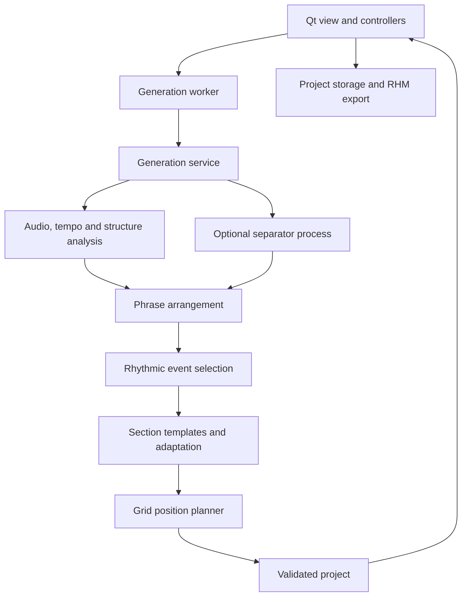

# Architecture

Rhythia Map Studio separates musical analysis, document state and Qt presentation. `Studio` composes focused controllers and an explicit set of view references.

## Data flow

The service returns a completed project and the original audio. The generation controller installs the result on the UI thread. Cancellation leaves the previous document in place.

## Module boundaries

Paths below are relative to `src/rhythia_studio/`.

| Area | Modules | Responsibility |
| --- | --- | --- |
| Composition | `ui/window.py`, `ui/view.py`, `ui/layout.py` | Compose the window, declare control references and build individual panels |
| UI workflows | `ui/controllers/` | Document operations, generation jobs, editing and playback |
| UI infrastructure | `ui/widgets.py`, `ui/workers.py`, `ui/theme.py` | Custom previews, background work and shared styling |
| Session state | `document.py`, `editing.py`, `snapshots.py`, `immutable.py` | Editable state, history and isolated snapshots |
| Analysis | `audio.py`, `timing.py`, `structure.py`, `musical_features.py` | Audio features, beat timing, repeated sections and source descriptors |
| Musical generation | `arrangement.py`, `rhythm.py`, `generation.py`, `planner.py`, `profiles.py` | Phrase lead selection, events, pattern reuse, geometry and tuning |
| Orchestration | `services.py`, `separation.py` | Analysis cache and optional external separator |
| Persistence | `contracts.py`, `project_validation.py`, `project.py`, `quality.py` | Typed data, validation, export and diagnostics |
| Localization | `messages.py`, `i18n.py`, `ui/localization.py`, `ui/dialogs.py` | Structured messages, catalogs and translated presentation |
| Startup | `app.py`, `installation_check.py` | Application startup, logging and packaged-installation checks |

## Document contracts

`TypedDict` definitions document the JSON-compatible wire format. Runtime validation checks settings, temporal axes, descriptor lengths, section and phrase intervals, sources and notes before a project reaches the editor.

- Note times are unique, ordered integer milliseconds within the audio duration.
- Grid coordinates are in the range 0–2.
- Audio bytes are verified using SHA-256 and preserved without recompression.
- The document's `version` identifies its schema; `analysis_version` identifies its descriptor format.
- Project schema v1 is the format for version 0.1.0. Other schema versions are rejected.
- Canonical difficulty and style IDs are English and independent of UI language.

Project ZIP files are read through known entry names with size limits. Saving writes a temporary file and uses `os.replace` to avoid partially replacing the destination. RHM export writes only `Time`, `X` and `Y` for each note; editor metadata remains in the project.

## State ownership and threading

`DocumentSession` holds the project, audio, file path, dirty state and history. Controllers own their workflow resources: playback owns the player and temporary audio files; generation owns the active analysis worker; document operations own recovery saves.

Analysis starts as mutable dictionaries and lists. It is recursively frozen when cached or installed in a completed project. History and autosave snapshots share that read-only payload while copying editable notes and settings. Build a new analysis when descriptors need to change.

UI controllers are `QObject` instances created on the main thread. Workers do not access widgets: they emit completed results or structured errors. Parameters are captured before work starts, and cancellation never installs a partial result. Worker failures retain tracebacks in the application log.

## Musical pipeline

Structural analysis compares sequences of half-beat descriptors containing harmony, timbre, attacks and energy. Similar non-overlapping windows receive a shared group ID. Each difficulty plans a template for a group's first occurrence, then adapts subsequent occurrences to local duration, attacks and silence.

Phrase arrangement chooses a stable lead, intensity, accents and breathing space. The position planner balances geometric targets, movement speed, turns and repeated trajectories. Repetition diagnostics recognize translated, rotated and reflected shapes. The current search uses an eight-note horizon, a beam width of fourteen and a rolling twenty-four-note history.

Tuning values and their units are documented in `profiles.py`. They are heuristics, not official difficulty ratings. Keep tuning changes separate from refactors, and evaluate synchronization and comfort manually as well as through tests.

## UI and localization

`StudioView` declares control references; layout builders do not inject attributes into the window. The theme centralizes spacing, borders, radii and control states. Basic controls support the automatic workflow, while specialist settings and editing tools appear under Advanced options.

Combo boxes receive canonical `itemData` when constructed. Translation changes labels only. Controls with dynamically managed text use the `dynamicText` property. See [I18N.md](I18N.md) for message and catalog conventions.

## Testing boundaries

Automated tests use temporary synthetic audio and offscreen, muted UI instances. They cover timing, pattern reuse, editing, history, persistence, export, localization, cancellation, failure logging and UI-thread installation of results.

The real separator and model are optional and are not downloaded by the suite. Packaged startup and real-song playtesting are separate checks, described in [BUILDING.md](docs/BUILDING.md).
